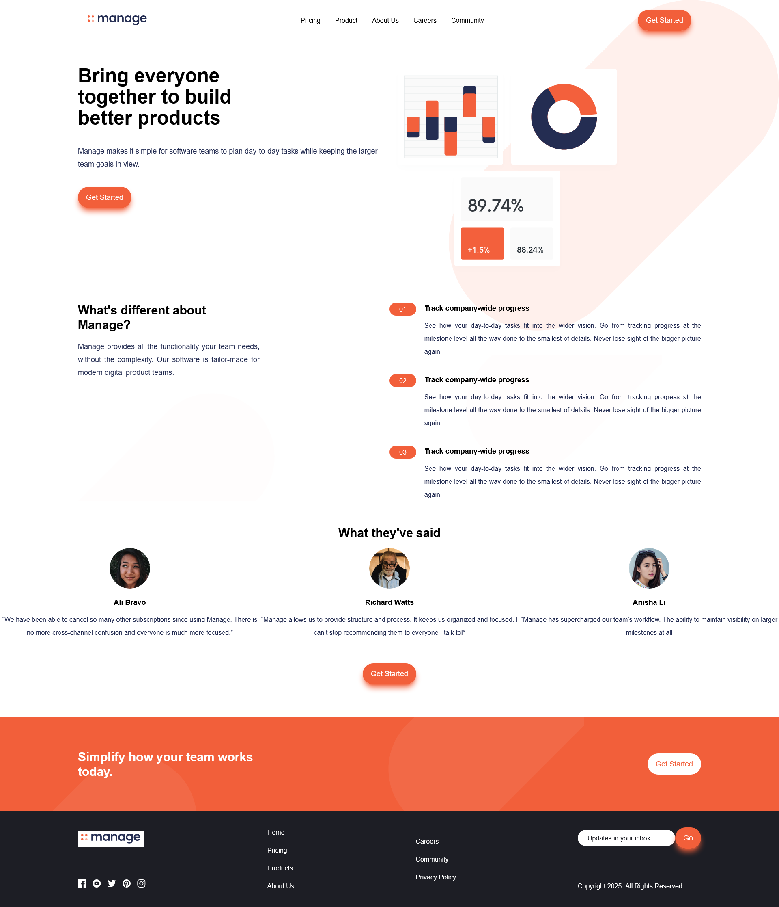

# Frontend Mentor - Manage landing page solution

This is a solution to the [Manage landing page challenge on Frontend Mentor](https://www.frontendmentor.io/challenges/manage-landing-page-SLXqC6P5). Frontend Mentor challenges help you improve your coding skills by building realistic projects. 

## Table of contents

- [Overview](#overview)
  - [The challenge](#the-challenge)
  - [Screenshot](#screenshot)
  - [Links](#links)
- [My process](#my-process)
  - [Built with](#built-with)
  - [What I learned](#what-i-learned)
  - [Continued development](#continued-development)
  - [Useful resources](#useful-resources)
- [Author](#author)

**Note: Delete this note and update the table of contents based on what sections you keep.**

## Overview

### The challenge

Users should be able to:

- View the optimal layout for the site depending on their device's screen size
- See hover states for all interactive elements on the page
- See all testimonials in a horizontal slider
- Receive an error message when the newsletter sign up `form` is submitted if:
  - The `input` field is empty
  - The email address is not formatted correctly

### Screenshot




### Links

- Solution URL: [GitHub Repo](https://github.com/oluwakayodefabian/frontentmentor-manage-landing-page-challenge)
- Live Site URL: [Add live site URL here](https://your-live-site-url.com)

## My process

### Built with

- Semantic HTML5 markup
- CSS custom properties
- Mobile-first workflow
- [Tailwind CSS](https://tailwindcss.com/) - Tailwind CSS
- [Owl Carouser](https://nextjs.org/) - For testimonial Slider
- [Alpine Js](https://alpinejs.dev/) - FOr toggling the mobile navigation popup

### What I learned

I learnt how to use Tailwind CSS for the first time to style a webpage. I also made use of Alpine Js, which is a lightweight, JavaScript framework

To see how you can add code snippets, see below:

```html
 <template x-if="opened">
    <div id="overlay" class="w-full"
      style="position:fixed; top: 0; left: 0; height: 100vh; background-color: rgba(0, 0, 0, 0.3);"></div>
  </template>
  <!-- Header -->
  <header class="relative container mx-auto p-6">
    <nav class="flex justify-between items-center">
      
      <div class="hidden md:flex items-center space-x-9">
        <a href="#" class="hover:text-app-orange-400">Pricing</a>
        <a href="#" class="hover:text-app-orange-400">Product</a>
        <a href="#" class="hover:text-app-orange-400">About Us</a>
        <a href="#" class="hover:text-app-orange-400">Careers</a>
        <a href="#" class="hover:text-app-orange-400">Community</a>
      </div>
      <a href="#" class="btn-primary hidden md:block">Get
        Started</a>
      <template x-if="!opened">
        
      </template>

      <template x-if="opened">
        
      </template>
    </nav>
    <!-- Mobile Nav -->
    <nav id="mobile-nav" class="shadow-xl shadow-app-blue-950 bg-white p-6 absolute rounded-sm"
      style="width: 90%; top:140%; left: 50%; transform: translateX(-50%);" x-cloak x-show="opened"
      @click.outside="opened = false">
      <div class="flex flex-col items-center space-y-10">
        <a href="#" class="hover:text-app-orange-400">Pricing</a>
        <a href="#" class="hover:text-app-orange-400">Product</a>
        <a href="#" class="hover:text-app-orange-400">About Us</a>
        <a href="#" class="hover:text-app-orange-400">Careers</a>
        <a href="#" class="hover:text-app-orange-400">Community</a>
      </div>

    </nav>
  </header>
```

```js
<script>
    $('.owl-carousel').owlCarousel({
      autoplay: true,
      responsiveClass: true,
      responsive: {
        0: {
          items: 1,
          nav: true
        },
        600: {
          items: 3,
          nav: false
        },
        1000: {
          items: 3,
          nav: true,
          loop: true
        }
      },
      loop: true,
      nav: true,
      navText: [
        "<i class='fa fa-chevron-left left-arrow'></i>",
        "<i class='fa fa-chevron-right right-arrow'></i>"
      ],
      dots: true
    });
  </script>
```

### Useful resources

- [X-data directive](https://alpinejs.dev/directives/data) - This helped me in setting up the initial  the mobile nav modal.

## Author

<!-- - Website - [Oluwakayodefabian](https://www.your-site.com) -->
- Frontend Mentor - [@oluwakayodefabian](https://www.frontendmentor.io/profile/oluwakayodefabian)
- Twitter - [@OwotokeO](https://www.twitter.com/OwotokeO)

